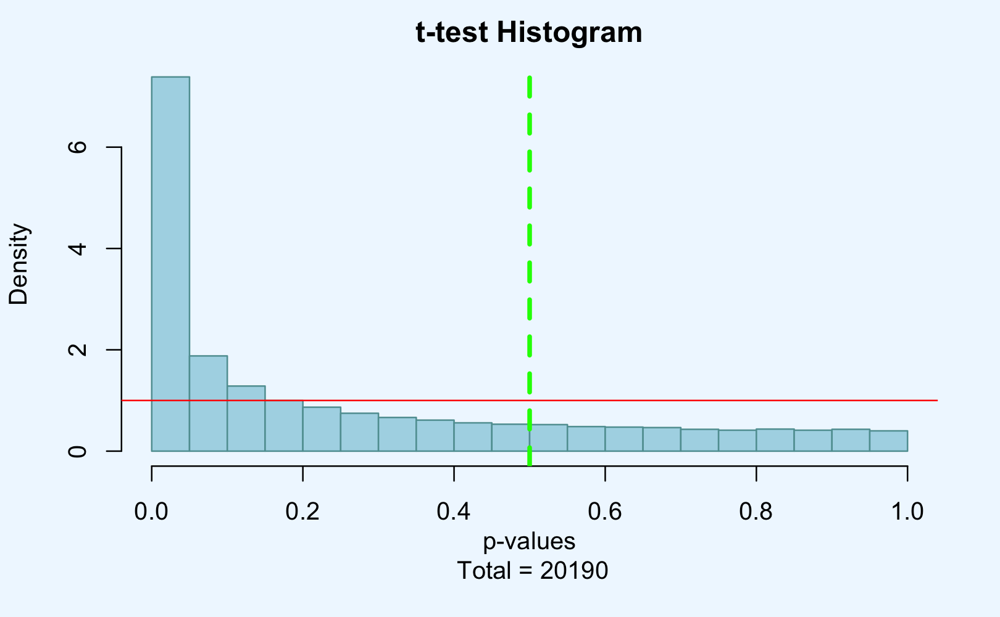

Evaluating p-values
================
José C.S. Curet

The objective of this project for a statistic class was to evaluate the effectiviness of
different p-value methods. Using some of the data from the following
publication:

Elias D, Vever H, Lænkholm AV, et al. *Gene expression profiling
identifies FYN as an important molecule in tamoxifen resistance and a
predictor of early recurrence in patients treated with endocrine
therapy* \[published correction appears in Oncogene. 2018
Oct;37(41):5585-5586\]. Oncogene. 2015;34(15):1919‐1927.
<doi:10.1038/onc.2014.138>

### Description:

In this article they present breast cancer cells susceptibles and
resistant to Tamoxifen, then they compare the gene expression with the
cells susceptibility to the drug. Compose of 54675 features and 18 samples, which are divided into 10 resistant and 8 sensitive to Tamoxifen.

### Analysis:

Doing a `t-test` to evaluate all the features of the cell lines to identify which are resistant or no I was able to observe 20190 p-values showing significance.

Next we have a histogram of the `t-test` showing the p-values.

  - Observing the graph, we have a relative uniform behavior, the values are distributed from 0 to 1 and we can see a p-values peak close to 0, which could represent the alternative hypotesis and is probably where the false positive lie on.

  - For this first analysis we have 20190 p-values with statistical significance, since they are below the established standard 0.05.

  - Something else to have in mind is that to more data, grater the possibility to get a FWER(family-wise error rate), Type I error.

  - Calculating the probability of finding a FWER, taking in consideration each sample is independent. For this test I calculated with 1000 data, and a p-value less than 0.05. I was able to see that the probability is 1 of finding a FWER, which made it occurrence completely possible, implying I should use another method to reduce the error.

Using the `Bonferroni` method to get the sum of the p-values less than 0.05 I got 274.

  - Comparing to the amount of p-values obtained before we get that Bonferroni method it is73.6861313869 times smaller. Showing a big adjustment, also by avoiding having Type I errors we could be getting Type II errors, false negatives.

With `Benjamini & Hochberg` method I got 11827 statistical significant.

Last, testing with the package `qvalue` I got 19367 considered significant.

To conclude, using the `qvalue` and `Benjamini & Hochberg` we can see that they are less conservative than `Bonferroni` and the adjustment allows more possible p-values.

I consider that each method could be used depending on the research style and type of dataset being used. If someone wants more window to evaluate the data and sacrifice the probability of getting more Type I error they should consider using the `Benjamini & Hochberg` or  `qvalue`. Otherwise would like to possibly risk having more Type II error could consider `Bonferroni`.

[return to Work](./)