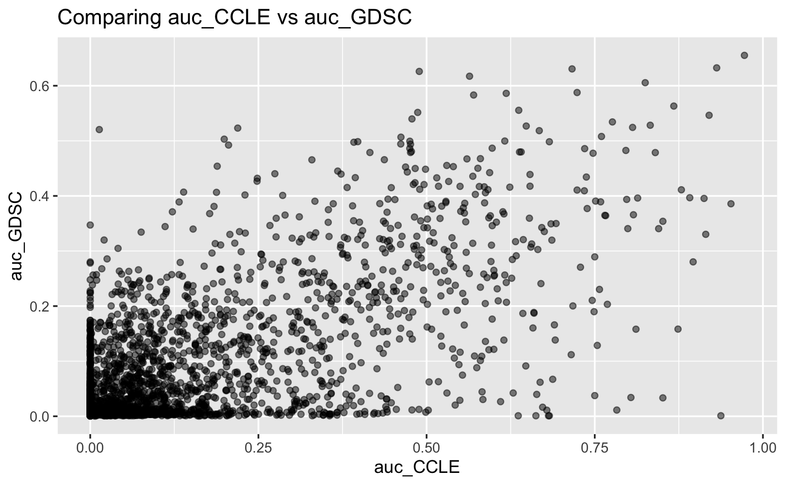

Replicathon 2020 - IQ BIO REU
================
José C.S. Curet and Vanessa Janet Viveros

In June we participated in a replicathon with the objective to do an analysis and evaluate if two pharmacogenomic experiments are actually replicable using a pharmacogenomic dataset, following some of the important question we were able to answer and our findings.

### Description:

The dataset has 288 unrepeated cellines

|8 CCLE drug concentrations|        
|--------|:-------|:-------|------|------|-----|------|---|
|0.0025  |0.008  |0.025  |0.08  |0.25  |0.8  |2.53  |8  

| 32 GDSC drug concentrations|
|-----------------------------|:------:|-------------:|---------|-------------|-----------|--------|--------|
| 4e-04                       |  8e-04 | 0.0009765625 | 0.0016  | 0.001953125 | 0.0032    | 0.0032 | 0.0064 |
| 0.0078125                   | 0.0128 |     0.015625 | 0.0256  | 0.03125     | 0.0390625 | 0.0512 | 0.0625 |
| 0.078125                    | 0.1024 |        0.125 | 0.15625 | 0.15625     | 0.3125    | 0.5    | 0.625  |
| 1                           | 1.25   | 2            | 2.5     | 4           | 5         | 8      | 10     |

Following a histogram of the data distribution

### Analysis:

Observing the graph we can see how the drug viability is skew to the left, having a high increase in viability in the between approximately 76 to 112.

|Viability Analysis|
|below 0| over 100| bt. 0 and 100|
|-------|-------|-------|
|23|15778|15740|

Cell viability is the quantification of the number of live cells. Below 0 represents a negative amount of living cells (which could show a present misread), above 100 correspond to healthy cells over the total amount the last `15740` suggest the amount of living cells between 0 to 100.

In these specific tests, most cells died around 100. If they passed 100, they were most resistant to the drug treatment.

|Summary of the data|
| cellLine |    drug   | ic50 CCLE | auc CCLE  | ic50 GDSC  | auc GDSC |
|----------|---------|----------|-----------|------------|----------|
| 22RV1    | Nilotinib | 8.000000  | 0.0000000 | 155.269917 | 0.003935 |
| 5637     | Nilotinib | 7.475355  | 0.0072625 | 219.934550 | 0.003616 |
| 639-V    | Nilotinib | 8.000000  | 0.0710125 | 92.177125  | 0.007622 |
| 697      | Nilotinib | 1.910434  | 0.1573375 | 3.063552   | 0.069265 |
| 769-P    | Nilotinib | 8.000000  | 0.0000000 | 19.633514  | 0.028758 |
| 786-0    | Nilotinib | 8.000000  | 0.0750125 | 137.066882 | 0.005482 |

We got Ic50 (concentration at which cell growth is inhibited 50%) and auc (area under the activity curve)

Based on observing the data on this histogram Viability  per Count by Concentrations we can see the viability of drugs by concentrations isn't consistent.

|Calculating Correlation Coefficient Pearson vs Spearman|
| drug |    Pearson ic50   | Spearman ic50 |
|----------|---------|----------|
| 17-AAG     | 0.54314746 | 0.58561036 |
| AZD0530    | 0.45547653 | 0.35966251 |
| AZD6244    | 0.31977283 | 0.24393054 |
| Crizotinib | 0.40938256 | 0.10594891 |
| Erlotinib  | 0.08123348 | 0.08000003 |
| lapatinib  | 0.42661370 | 0.28939931 |
| Nilotinib  | 0.61112054 | 0.12182947 |
| Nutlin-3   | 0.14320626 | 0.30580264 |
| paclitaxel | 0.21072510 | 0.34988436 |
| PD-0325901 | 0.62467771 | 0.58014767 |

These drugs studies have large sparsity. Spearman correlations allow us to work with normal data and make a better estimate of correlation. Since we are't working with a normal distributed data it is better for this case to use over Pearson and calculating with a distance correlation, which is sensitive to nonlinear relationships we got 0.6344005.

On the correlation made comparing the AUC of CCLE vs GDSC we can see  `0.6344005` as correlation between auc_CCLE vs auc_GDSC, and based on the other previous correlation analysis it seems to be a correlation between the studies of AUCs but not between studies and IC50s.

[return to Work](./)
