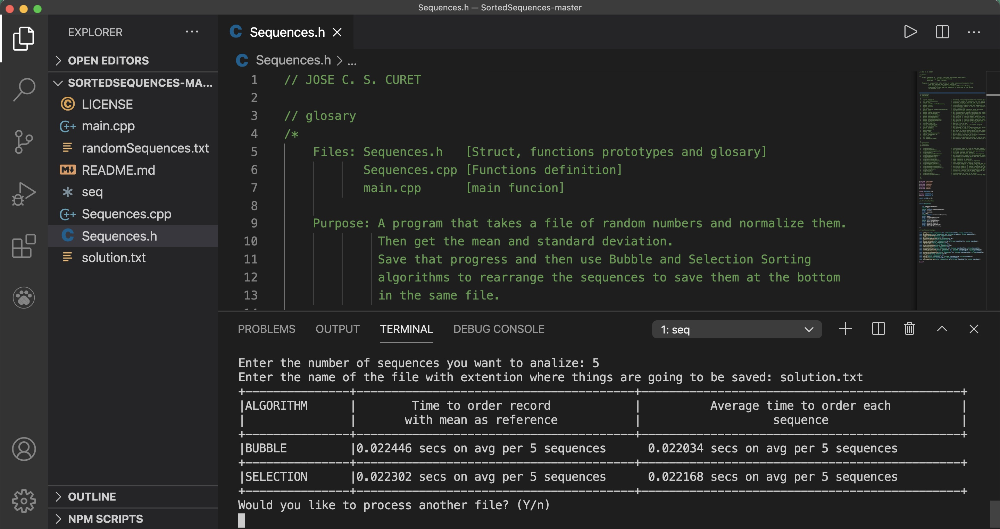

Sorted Sequences
================

This is a simple project for a programming class in C++, where I had to read a file of random numbers, with 10 columns, and organize the numbers using two algorithms, Bubble and Selection sort, calculate the mean and standard deviation and the time it took each algorithm to complete each task.

After analyzing the file the program produced the table below showing the
time it took each algorithm to sort the sequences, per record or per sequence.

First the time it took each algorithm in order each record.
Second the time it took each algorithm to order the generated sequences.

Project on [GitHub](https://github.com/curet/SortedSequences)

[return to Work](./)